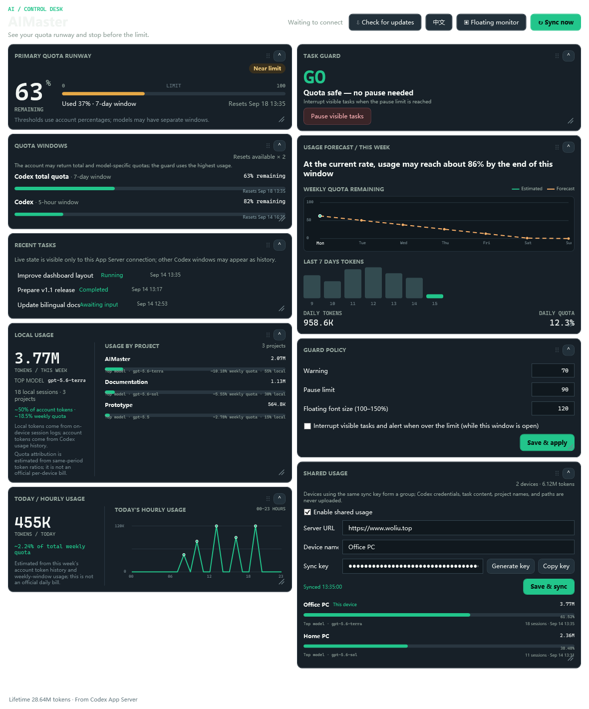
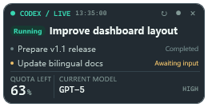

# AIMaster

<p align="center">
  <a href="README.md">简体中文</a> · <strong>English</strong>
</p>

<p align="center">
  
</p>

AIMaster is a standalone Windows monitor for Codex quota and task activity. It brings quota remaining, reset times, weekly forecasts, recent tasks, execution status, model and reasoning effort into one dashboard, with an optional compact desktop overlay.

## Highlights



- View total Codex quota, 7-day and 5-hour windows, usage percentages, and reset times.
- Forecast the remaining weekly quota from Monday through Sunday using recent consumption.
- Track this device's weekly Codex tokens and token-weighted top model, estimate device/project quota attribution from same-period account token history, and show each project's top model without assigning multi-device usage entirely to the current machine.
- Show today's local tokens, their estimated share of the account's total weekly quota, and an hourly usage line chart from 00 through 23.
- Optionally group multiple devices through Woliu shared usage and show each device's token share, top model, session count, and last sync time.
- Configure warning and pause thresholds; optionally interrupt tasks visible to the current App Server connection.
- Collapse cards, drag their headers between two columns, and resize them from the lower-right corner. Layout and sizes persist automatically.
- View recent tasks with running, waiting, interrupted, and completed states.
- Use either the Codex conversation title or the latest user request as the displayed task name.
- Inspect the active model and reasoning effort.
- Adjust floating-window text from 100% to 150% in the main-window settings.
- Dock and auto-hide the overlay on the top, left, or right edge of any monitor. Refreshing pauses while hidden.
- Switch between Simplified Chinese and English instantly.
- Check GitHub Releases automatically or install an available update directly from the app.
- Keep monitoring in the system tray after closing the main window.

## Download and run

Download a prebuilt Windows x64 package from [GitHub Releases](https://github.com/PN-BUG/AI-Master/releases):

- `AIMaster-win-x64-standalone.zip`: complete build with the .NET runtime included.
- `AIMaster-win-x64-lightweight.zip`: smaller build requiring [.NET 8 Desktop Runtime x64](https://dotnet.microsoft.com/download/dotnet/8.0).

1. Extract the ZIP archive.
2. Install and sign in to Codex.
3. Run `AIMaster.exe`.

Both packages require Codex and preserve local settings during in-app updates. The standalone package does not require a separate .NET Desktop Runtime installation.

## Requirements

- Windows 10 or Windows 11.
- Codex installed and signed in. The `codex` command should be on `PATH`, or Codex Desktop should use its standard installation location.
- Codex App Server available for live quota and online task data.

## Floating monitor



Open it with **Floating monitor** in the main window:

- Drag it to the top, left, or right screen edge to auto-hide it.
- Only an 8 px hover strip remains while hidden, and background refreshing pauses.
- Hover over the strip to expand and refresh immediately.
- Right-click to refresh, collapse or expand, select the task-name source, enable auto-hide, or change the refresh interval.
- Up to three recent tasks are shown, and the width adapts to task and model names.
- Closing the main window hides it to the Windows system tray. Click the tray icon to restore it, or use its menu to open the floating monitor or exit AIMaster.

## Data and privacy

AIMaster starts the local `codex app-server --listen stdio://` process and uses the sign-in state maintained by Codex. It does not read, copy, or store login tokens.

Shared usage is disabled by default. When enabled, only weekly device aggregates are sent to `https://www.woliu.top/api/v1/aimaster/sync`; Codex credentials, task content, project names, and paths are excluded. The sync key is encrypted locally with Windows DPAPI.

When App Server data is unavailable, AIMaster falls back to local session records under `%USERPROFILE%\.codex\sessions` for the task list. Settings are stored in `%LOCALAPPDATA%\AIMaster\settings.json`. Existing `%LOCALAPPDATA%\SoftwareToolkit\ai-manager.json` settings are migrated on first launch.

The conversation-title mode uses Codex task metadata. The latest-request mode extracts the most recent real user message while excluding injected attachment notes and environment metadata.

## Build from source

Install the [.NET 8 SDK](https://dotnet.microsoft.com/download/dotnet/8.0), then run:

```powershell
dotnet build .\AIMaster.sln -c Release
```

Create both the standalone and lightweight folders and ZIP archives:

```powershell
powershell -NoProfile -ExecutionPolicy Bypass -File .\build.ps1 -All
```

On Windows, you can also double-click `package-all.cmd`. All generated packages are placed under `release`.

Other packaging options:

```powershell
# Standalone Windows x64
.\build.ps1

# Lightweight Windows x64
.\build.ps1 -Lightweight

# Windows ARM64
.\build.ps1 -Runtime win-arm64
```

More documentation:

- [User guide](docs/USER-GUIDE.en.md)
- [中文用户手册](docs/USER-GUIDE.md)
- [Development and build notes (Chinese)](docs/DEVELOPMENT.md)
- [Troubleshooting (Chinese)](docs/TROUBLESHOOTING.md)

## License

Apache License 2.0. See [LICENSE](LICENSE).
