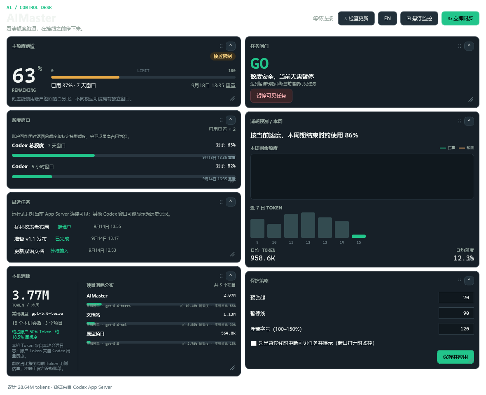
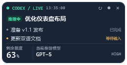

# AIMaster

<p align="center">
  <strong>简体中文</strong> · <a href="README.en.md">English</a>
</p>

<p align="center">
  
</p>

AIMaster 是一个可独立运行的 Windows Codex 用量与任务监控工具。它集中展示剩余额度、额度重置时间、消耗预测、最近任务、执行状态、当前模型与推理强度，并提供紧凑的桌面悬浮窗。

## 主要功能



- 显示 Codex 总额度、7 天窗口、5 小时窗口与重置时间。
- 根据近期消耗速度预测额度是否会提前耗尽。
- 设置预警线和暂停线，越线时提醒并暂停当前连接可见的任务。
- 用折线图展示本周一至周日的剩余额度估算与未来预测。
- 汇总本周本机 Codex Token 消耗和按 Token 加权的常用模型；结合账号同周期 Token 历史估算当前设备与各项目的周额度占比，并为每个项目显示常用模型，避免把多设备总用量全部归到本机。
- 支持折叠仪表盘卡片、拖动标题栏调整双列布局，以及拖动右下角自由调整卡片宽高；布局和尺寸会自动保存。
- 显示最近执行的最多 3 个任务，包括进行中、暂停/中断和已完成状态。
- 任务名称可选择显示 Codex 对话标题或该任务最后发送的用户内容。
- 显示任务当前使用的模型与推理强度。
- 提供 180–260 px 自适应紧凑悬浮窗，浮窗字号可在主窗口设置中调整。
- 支持多显示器靠边收起；收起时停止刷新，悬停展开后立即刷新。
- 支持手动刷新、1/2/5/10/30 秒刷新频率和右键自动收起开关。
- 支持简体中文与英文即时切换。
- 启动时自动检测 GitHub Release，也可在主窗口检查并直接下载安装新版本。
- 主窗口显示任务栏入口；悬浮窗不占任务栏位置。
- 关闭主窗口后隐藏到 Windows 系统托盘并保持后台监控；托盘菜单可恢复窗口或真正退出。

## 直接运行

预编译的 Windows x64 版本请从 [GitHub Releases](https://github.com/PN-BUG/AI-Master/releases) 下载；本地运行 `build.ps1` 后，发布文件位于 `release`：

- `release/AIMaster-win-x64-standalone.zip`：完整独立版，包含 .NET 运行时。
- `release/AIMaster-win-x64-lightweight.zip`：轻量多文件版，需要 [.NET 8 Desktop Runtime x64](https://dotnet.microsoft.com/download/dotnet/8.0)。

1. 解压 ZIP。
2. 确保 Codex 已安装并完成登录。
3. 双击 `AIMaster.exe`。

完整独立版无需另外安装 .NET Desktop Runtime；轻量版体积更小，适合已经安装 .NET 8 Desktop Runtime 的电脑。两个版本均不包含 Codex 本身。

AIMaster 启动时会静默检查 GitHub Release，也可点击主窗口的“检查更新”。发现新版后会显示“立即更新”，自动选择与当前架构及轻量/独立模式匹配的 ZIP，校验后退出、替换并重启；失败时会恢复旧版本，本地设置不会被覆盖。

## 使用要求

- Windows 10/11。
- 已安装并登录 Codex；`codex` 命令在 PATH 中，或使用标准的 Codex Desktop 安装位置。
- 读取额度和在线任务时，Codex App Server 需要可用。

## 悬浮窗



在主窗口点击“悬浮监控”打开悬浮窗：

- 拖到任意显示器边缘可自动收起。
- 收起时只保留 8 px 感应条并停止后台刷新。
- 鼠标悬停感应条会展开并立即刷新。
- 右键可立即刷新、切换收起状态、选择任务名称来源、开启或关闭靠边自动收起、修改刷新频率。
- 内容宽度会根据任务名和模型名自动调整，最多显示 3 个最近任务。
- 浮窗字号可在主窗口“保护策略”中按 100–150% 调整。
- 主窗口右上角关闭按钮只会隐藏窗口。单击托盘图标可恢复，右键托盘图标可打开悬浮监控或退出 AIMaster。

## 数据来源与隐私

AIMaster 启动本机的 `codex app-server --listen stdio://` 并使用 Codex 自己维护的登录状态。工具不会读取、复制或保存登录令牌。

当 App Server 暂时不可用时，任务列表会从 `%USERPROFILE%\.codex\sessions` 中的本地会话记录降级读取。设置保存在 `%LOCALAPPDATA%\AIMaster\settings.json`。第一次启动会自动迁移旧版 `%LOCALAPPDATA%\SoftwareToolkit\ai-manager.json` 设置。

“对话标题”来自 Codex 的任务元数据；“最后发送内容”从对应任务最近一条真实用户消息中提取。附件说明、环境信息等注入文本不会作为任务名。

## 从源码构建

需要 [.NET 8 SDK](https://dotnet.microsoft.com/download/dotnet/8.0)。

```powershell
dotnet build .\AIMaster.sln -c Release
```

生成 Windows x64 自包含包：

```powershell
powershell -NoProfile -ExecutionPolicy Bypass -File .\build.ps1
```

一键生成完整版、轻量版两个发布目录和对应的两个 ZIP：

```powershell
powershell -NoProfile -ExecutionPolicy Bypass -File .\build.ps1 -All
```

Windows 下也可以直接双击 `package-all.cmd`。输出统一位于 `release` 目录。

生成 Windows x64 轻量版：

```powershell
powershell -NoProfile -ExecutionPolicy Bypass -File .\build.ps1 -Lightweight
```

ARM64：

```powershell
powershell -NoProfile -ExecutionPolicy Bypass -File .\build.ps1 -Runtime win-arm64
```

更多信息：

- [用户手册](docs/USER-GUIDE.md)
- [English user guide](docs/USER-GUIDE.en.md)
- [开发与构建](docs/DEVELOPMENT.md)
- [故障排查](docs/TROUBLESHOOTING.md)

## License

Apache License 2.0，详见 [LICENSE](LICENSE)。
